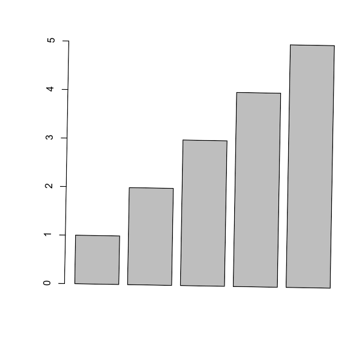

```r
require(ggplotify)
require(magick)

img <- magick::image_graph(600, 600, res = 96)
invisible(lapply(seq(1, 360, length.out=30), function(angle) {
    print(as.ggplot(~barplot(1:5), angle=-angle, scale = 1-angle/360))
}))
grDevices::dev.off()

animation <- magick::image_animate(img, fps = 2)
magick::image_write(animation, "rotate-scale.gif")
```



