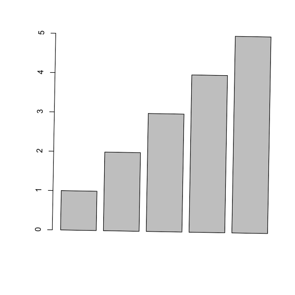

```{r include=FALSE}
library(conflicted)
library(dplyr)
library(plotbb)

options(width=60)

conflict_prefer("filter", "dplyr")
conflict_prefer("as.data.frame", "BiocGenerics")


CRANpkg <- function (pkg) {
    cran <- "https://CRAN.R-project.org/package"
    fmt <- "[%s](%s=%s)"
    sprintf(fmt, pkg, cran, pkg)
}

Biocpkg <- function (pkg) {
    sprintf("[%s](http://bioconductor.org/packages/%s)", pkg, pkg)
}

Githubpkg <- function (user, pkg) {
    gh <- "https://github.com"
    fmt <- "[%s](%s/%s/%s)"
    sprintf(fmt, pkg, gh, user, pkg)
}

library(knitr)
opts_chunk$set(message=FALSE, warning=FALSE, eval=TRUE, echo=TRUE, cache=TRUE)
```


# Preface {-}

hello world

<!--chapter:end:index.Rmd-->

# (PART\*) Part I: Visualization {-}

# Grammar of Graphics for base plot {#plotbb}


```{r include=F}
library(dplyr)
library(plotbb) 
```

## Aesthetic mapping

`bb_aes()` for aesthetic mapping, that equivalents to `ggplot2::aes()`.


```{r plotbb-aes}
library(plotbb)

p <- bbplot(mtcars, bb_aes(mpg, disp, col=factor(cyl)))
p + bb_grid(col='grey50', lty='dashed') + bb_point(pch=19) 
```

## Geometric layer

```{r plotbb-layer, fig.width=12}
p2 <- p + bb_point() + bb_lm(bb_aes(group=cyl), lwd=2)
p3 <- p2 + bb_lm(col="red", lwd=3, lty='dotted')
p4 <- p + bb_text(bb_aes(label=cyl), cex=2)
par(mfrow=c(1,3))
p2; p3; p4
```

### Heatmap

```{r plotbb-heatmap, fig.width=8, fig.height=8}
df <- data.frame(x = rep(1:10, 12),
                 y = rep(1:12, each = 10),
                 values = rnorm(120, mean = 10, sd = 5),
                 type = sample(LETTERS[1:5], 120, replace=TRUE),
                 stringsAsFactors = FALSE)
par(mfrow=c(2,2))
bbplot(df, bb_aes(x,y, col=values)) + bb_tile() + 
  bb_title("heatmap for continuous numerical values") 
bbplot(df, bb_aes(x,y, col=values)) + bb_tile() + bb_scale_col_palette("YlOrRd") +
  bb_title("applying a color palette") 
bbplot(df, bb_aes(x,y, col=type)) + bb_tile() +
  bb_title("heatmap for discrete categorical values") 
bbplot(df, bb_aes(x,y, col=values)) + bb_tile() + bb_text(col='black') +
  bb_title("heatmap with text labels") + bb_theme_expand()
```

### TODO

+ [x] bb_grid
+ [x] bb_point
+ [x] bb_lm
+ [x] bb_text
+ [x] bb_tile
+ more layers need to be added


## Setting labels

```{r plotbb-labs}
p2 + bb_labs(title = "hello", sub = "just for demo",
              xlab="this is xlab", ylab = "this is ylab") +
  bb_title("hello world") # last one rules
```

## Theme

```{r plotbb-theme, fig.width=10}
g <- p2 +
     bb_theme(col.main="red", cex.main=2,
             mar = c(4, 4, 3, 1)) +
     bb_title("applying graphics::par")
par(mfrow=c(1,2))
print(g) 
p2 + bb_title("theme has no side effect")
```

`bb_theme` has no side effect and will only apply to the `bbplot` object that it added to.
This is very important for developing pre-defined themes.


```{r plotbb-theme-expand, fig.width=10}
par(mfrow=c(1,2)) 
p3 + bb_theme_expand()
print(p3)
```

```{r plotbb-theme-grey}
p + bb_grid(col='grey50', lty='dashed') +
  bb_point(pch=19) +
  bb_theme_expand() +
  bb_theme_grey() 
```

```{r plotbb-theme-blue}
p + bb_point(pch=19, cex=2) +
  bb_theme_expand() +
  bb_theme_deepblue() 
```

### TODO

+ [x] `bb_theme_expand`
+ [x] `bb_theme_grey`
+ [x] `bb_theme_deepblue`
+ develop more pre-defined themes

## Scale

+ [x] `bb_scale_col_palette`
+ more to be implemented

## Legend

Not yet implemented


## Using existing code with plotbb

Suppose we have existing code to plot something:

```r
plot(mtcars$mpg, mtcars$disp)
abline(lm(disp ~ mpg, data=mtcars), col='red')
```

We can wrap the codes into a function:

```{r}
f <- function() { 
  plot(mtcars$mpg, mtcars$disp)
  abline(lm(disp ~ mpg, data=mtcars), col='red')
}
```

Then we can convert it to a `bbplot` object. The plot produced by the function will be used as the canvas, and we can apply theme and add layers to it:

```{r}
library(dplyr) 
d <- group_by(mtcars, cyl) %>%
  summarize(xm=mean(mpg), ym=mean(disp))

pp <- as.bbplot(f) +
   bb_theme_expand() +
   bb_theme_grey() +
   bb_lm(bb_aes(mpg, disp, group=cyl, col=factor(cyl)), data=mtcars, lwd=2, lty='dashed') +
   bb_point(bb_aes(xm, ym, col=factor(cyl)), data=d, pch=19, cex=2) +
   bb_title("hello plotbb") +
   bb_grid(col='grey30', lty='dashed') ## grid lines were plotted as background by default
```

As there are many features currently not available, `plotbb` supports adding layers using base graphics commands that you are already familiar with. Any base graphics commands in formula, expression or function can be served as layer to be added to a `bbplot` object.


```{r plotbb-base}
pp + (~points(30, 400, pch=19, col="red", cex=3)) + 
   ~text(30, 420, label="hae fun :)", col="blue", cex=1.2)
```

<!--chapter:end:01-plotbb.Rmd-->

# Use image in ggplot2 {#ggimage}

```{r echo=FALSE, results="hide", message=FALSE}
library("ggplot2")
library("ggimage")
```


## geom_image

```{r geom-image, warning=FALSE}
library("ggplot2")
library("ggimage")

set.seed(2017-02-21)
img <- list.files(system.file("extdata", package="ggimage"),
                  pattern="png", full.names=TRUE)
d <- data.frame(x = rnorm(10),
                y = rnorm(10),
                image = sample(img, size=10, replace = TRUE)
                )

ggplot(d, aes(x, y)) + geom_image(aes(image=image), size=.05)
ggplot(d, aes(x, y)) + geom_image(aes(image=image), size=.05, by='height')

ggplot(d, aes(x, y)) + geom_image(image=d$image[1])
d$size=seq(.05, .15, length.out=10)
ggplot(d, aes(x, y)) + geom_image(aes(image=image, size=I(size)))

ggplot(d, aes(x, y)) + geom_image(aes(image=image), color="firebrick")
```

## geom_pokemon

```{r geom-pokemon}
ggplot(d, aes(x, y)) + geom_pokemon(aes(image=ifelse(x>0, 'pikachu', 'tauros')), size=.1)
```

## geom_emoji

```{r geom-emoji}
set.seed(123)
iris2 <- iris[sample(1:nrow(iris), 30),]
model <- lm(Petal.Length ~ Sepal.Length, data=iris2)
iris2$fitted <- predict(model)

ggplot(iris2, aes(x = Sepal.Length, y = Petal.Length)) +
  geom_linerange(aes(ymin = fitted, ymax = Petal.Length),
                 colour = "purple") +
  geom_abline(intercept = model$coefficients[1],
              slope = model$coefficients[2]) +
    geom_emoji(aes(image = ifelse(abs(Petal.Length-fitted) > 0.5, '1f622', '1f600')))
```


## geom_phylopic

Please visit <https://yulab-smu.github.io/treedata-book/chapter8.html#phylopic> for more details.


## geom_flag

```{r geom-flag}
f <- system.file("extdata/medals.txt", package="ggimage")
medals <- read.table(f, header=TRUE)
p <- ggplot(medals, aes(Country, count)) + geom_col(aes(fill = medal), width = .8)

p + geom_flag(y = -2, aes(image = code)) +
    coord_flip() + expand_limits(y = -2)  +
    scale_fill_manual(values = c("Gold" = "gold", "Bronze" = "#cd7f32", "Silver" = "#C0C0C0"))
```

## geom_icon


```{r geom-icon, eval=F}
d$icon=sample(c('ios-power', 'ios-wifi', 'ios-pie'), 10, replace=TRUE)
ggplot(d, aes(x,y)) + geom_icon(aes(image=icon))
```

see also <https://ionicons.com/>.

## geom_subview

```{r geom-subview}
library(tibble)
dd <- data.frame(x=LETTERS[1:3], y=1:3)
pie <- ggplot(dd, aes(x=1, y, fill=x)) + geom_bar(stat="identity", width=1) + coord_polar(theta="y") +
    theme_void() + theme(legend.position="none") + theme_transparent()

df <- tibble(x = sample(2:9),
             y = sample(2:9),
             width = sample(seq(0.5, 3, length.out=length(x))),
             pie = list(pie))
p <- ggplot(data=data.frame(x=c(0, 10), y=c(0, 10)), aes(x, y))+geom_blank()
p + geom_subview(aes(x=x, y=y, subview=pie, width=width, height=width), data=df)
```

## geom_twitchemote

```{r geom-twitchemote}
set.seed(1)
x <- 1:10
y <- x + rnorm(10, sd = 1)
notlikethis <- data.frame(x = x, y = y)
n_pals      <- 200
pals        <- data.frame(
  x = runif(n_pals, -2, 12), y = runif(n_pals, -2, 12),
  pal = sample(c("wutface", "kappa", "pogchamp"), size = n_pals, replace = TRUE)
)

ggplot(notlikethis, aes(x = x, y = y)) +
  geom_twitchemote(data = pals,
                   aes(image = 'pogchamp'), size = 0.03, alpha = 0.3) +
  geom_twitchemote(aes(image = 'notlikethis'), size = 0.15) +
  geom_smooth()
```

<!--chapter:end:02-ggimage.Rmd-->

# Plot everything in ggplot


```r
require(ggplotify)
require(magick)

img <- magick::image_graph(600, 600, res = 96)
invisible(lapply(seq(1, 360, length.out=30), function(angle) {
    print(as.ggplot(~barplot(1:5), angle=-angle, scale = 1-angle/360))
}))
grDevices::dev.off()

animation <- magick::image_animate(img, fps = 2)
magick::image_write(animation, "rotate-scale.gif")
```




<!--chapter:end:03-ggplotify.Rmd-->

# Align Associated plots {#aplot}


For many times, we are not just aligning plots as what `cowplot` and `patchwork` did. We would like to align associated information that requires axes to be exactly matched in subplots. 


## Reconcile axis limits {#axis_align}

Suppose we have the following plots and would like to combine them in a single page.


```{r}
library(dplyr)
library(ggplot2)
library(ggstance)
library(ggtree)
library(patchwork)
library(aplot)

no_legend=theme(legend.position='none')

d <- group_by(mtcars, cyl) %>% summarize(mean=mean(disp), sd=sd(disp)) 
d2 <- dplyr::filter(mtcars, cyl != 8) %>% rename(var = cyl)

p1 <- ggplot(d, aes(x=cyl, y=mean)) + 
    geom_col(aes(fill=factor(cyl)), width=1) + 
    no_legend
p2 <- ggplot(d2, aes(var, disp)) + 
    geom_jitter(aes(color=factor(var)), width=.5) + 
    no_legend

p3 <- ggplot(filter(d, cyl != 4), aes(mean, cyl)) + 
    geom_colh(aes(fill=factor(cyl)), width=.6) + 
    coord_flip() + no_legend

pp <- list(p1, p2, p3)
```


We can use `r CRANpkg("cowplot")` or `r CRANpkg("patchwork")` to combine plots. 

```r
plot_list(pp, ncol=1)
```

However, these plots do not align properly (Figure \@ref(fig:axisAlign)A). 

There are two reasons:

+ the plotted data have different limits
+ the different plots have different amounts of expansion spaces 

To address these two issues, `r Biocpkg("ggtree")` provides `xlim2()` and `ylim2()` functions to set x or y limits^[the implementation was inspired by <https://thackl.github.io/ggtree-composite-plots>]. It use input `limits` to set axis limits that is similar to `xlim()` and `ylim()` (Figure \@ref(fig:axisAlign)B). If `limits = NULL` (by default), the `xlim2()` and `ylim2()` functions will calculate axis limits from input `ggplot` object. So that we can easily set limits of a `ggplot` object based on another `ggplot` object to uniformize their limits (Figure \@ref(fig:axisAlign)C). 

```r
pp2 <- lapply(pp, function(p) p + xlim2(limits=c(3, 11)))
pp3 <- lapply(pp, function(p) p + xlim2(p1))

plot_list(pp2, ncol=1)
plot_list(pp3, ncol=1)
```

If the plot was flipped, it will throw a message and apply the another axis. In this example, the x limit of `p1` is applied to y limit of `p3` as `p3` was flipped.


(ref:axisAlignscap) Setting x-axis limits for aligning plots.

(ref:axisAligncap) **Setting x-axis limits for aligning plots.** Composite plot that does not align properly (A column), align based on user specific limits (B column), and align based on xlim of the `p1` object (C column).

```{r axisAlign, echo=FALSE, fig.cap="(ref:axisAligncap)", fig.scap="(ref:axisAlignscap)", fig.width=12, fig.height = 9}
pp2 <- lapply(pp, function(p) p + xlim2(limits=c(3, 11)))
pp3 <- lapply(pp, function(p) p + xlim2(p1))

g1 <- plot_list(pp, ncol=1)
g2 <- plot_list(pp2, ncol=1)
g3 <- plot_list(pp3, ncol=1)

(g1 + plot_layout(tag_level = 'new') | g2 + plot_layout(tag_level = 'new') | g3 + plot_layout(tag_level = 'new')) +
  plot_annotation(tag_levels = c("A",1))
```

Similarly, we can use `ylim2()` to reconcile y axis. As we can see in Figure \@ref(fig:ylim2), only panel A and C were aligned properly.


(ref:ylim2scap) Setting y-axis limits for aligning plots.

(ref:ylim2cap) **Setting y-axis limits for aligning plots.** Composite plot that does not align properly (A vs B), and align based on ylim of the `p` object (A vs C).


```{r ylim2, fig.cap="(ref:ylim2cap)", fig.scap="(ref:ylim2scap)", fig.width=9, fig.height=3}
library(ggstance) 
p <- ggplot(mtcars, aes(disp, cyl, group=cyl)) + geom_boxploth()
p1 <- ggplot(subset(mtcars, cyl!=8), aes(disp, cyl, group=cyl)) + geom_point() 
p2 <- p1 + ylim2(p) 
p + p1 + p2 + 
  plot_annotation(tag_levels="A")
```


## Align associated subplots

With `xlim2()` and `ylim2()`, it is easy to align associated subplots to annotate a main figure. The `aplot` package provides `insert_left()`, `insert_right()`, `insert_top()` and `insert_bottom()` as shortcut to help users aligning subplots.


### A first glance

```{r}
library(ggplot2)
library(aplot)

p <- ggplot(mtcars, aes(mpg, disp)) + geom_point()
p2 <- ggplot(mtcars, aes(mpg)) + 
  geom_density(fill='steelblue', alpha=.5) + 
  ggtree::theme_dendrogram()
p3 <- ggplot(mtcars, aes(x=1, y=disp)) + 
  geom_boxplot(fill='firebrick', alpha=.5) + 
  theme_void()
ap <- p %>% 
  insert_top(p2, height=.3) %>% 
  insert_right(p3, width=.1)
## you can use `ggsave(filename="aplot.png", plot=ap)` to export the plot to image file
print(ap) # or just type ap will print the figure
```

### Aligning plots with a tree

Aligning a plot with a tree is difficult, as it requres expertise to extract the order of taxa on the tree.

```{r fig.width=7, fig.height=4}
library(ggtree)
set.seed(2020-03-27)
x <- rtree(10)
d <- data.frame(taxa=x$tip.label, value = abs(rnorm(10)))
p <- ggtree(x) + geom_tiplab(align = TRUE) + xlim(NA, 3)

library(ggstance)
p2 <- ggplot(d, aes(value, taxa)) + geom_colh() + 
  scale_x_continuous(expand=c(0,0)) 

library(patchwork)
p | p2
```

Althought `patchwork` did a good job at aligning y-axes among the two plots, the output is not what we want if the bar heights are associated with external nodes on the tree. It is not so obvious for an ordinary user to extract the order of tip label from the tree to re-draw the barplot. 

If we insert a `ggtree` object in `aplot`, it will transform other plots in the same row (`insert_left` and `insert_right`) or same column (`insert_top` and `insert_bottom`) based on the tree structure.


```{r fig.height=4, fig.width=7}
p2 %>% insert_left(p)
```


### Creating annotated heatmap {#annoHeatmap}

The `xlim2()` and `ylim2()` functions create many possibilities to align figures. For instance, we can add column and row annotations around a heatmap in all sides (top, bottom, left and right). They can be aligned properly with the aids of `xlim2()` and `ylim2()` even with missing values presented as demonstrated in Figure \@ref(fig:ggComplexHeatmap).


(ref:ggComplexHeatmapscap) Create complex heatmap.

(ref:ggComplexHeatmapcap) **Create complex heatmap.** With the helps of `xlim2()` and `ylim2()`, it is easy to align row or column annotations around a figure (e.g. a heatmap).


```{r ggComplexHeatmap, fig.cap="(ref:ggComplexHeatmapcap)", fig.scap="(ref:ggComplexHeatmapscap)", fig.width=9.5, fig.height=6.5}
library(tidyr)
library(ggplot2)
library(ggtree)

set.seed(2019-11-07)
d <- matrix(rnorm(25), ncol=5)
rownames(d) <- paste0('g', 1:5)
colnames(d) <- paste0('t', 1:5)
hc <- hclust(dist(d))
hcc <- hclust(dist(t(d)))
phr <- ggtree(hc)
phc <- ggtree(hcc) + layout_dendrogram()

d <- data.frame(d)
d$gene <- rownames(d)
dd <- gather(d, 1:5, key="condition", value='expr')

p <- ggplot(dd, aes(condition,gene, fill=expr)) + geom_tile() + 
  scale_fill_viridis_c() +
  scale_y_discrete(position="right") +
  theme_minimal() + 
  xlab(NULL) + ylab(NULL) 

g <- ggplot(dplyr::filter(dd, gene != 'g2'), aes(gene, expr, fill=gene)) + 
  geom_boxplot() + coord_flip() +
  scale_fill_brewer(palette = 'Set1') +
  theme_minimal() + 
  theme(axis.text.y = element_blank(), 
        axis.ticks.y = element_blank(),
        panel.grid.minor = element_blank(),
        panel.grid.major.y = element_blank()) +
  xlab(NULL) + ylab(NULL) 

ca <- data.frame(condition = paste0('t', 1:5), 
                 A1 = rep(LETTERS[1:2], times=c(3, 2)),
                 A2 = rep(letters[3:5], times=c(1, 3, 1))
)
cad <- gather(ca, A1, A2, key='anno', value='type')

pc <- ggplot(cad, aes(condition, y=anno, fill=type)) + geom_tile() + 
  scale_y_discrete(position="right") +
  theme_minimal() + 
  theme(axis.text.x = element_blank(), 
        axis.ticks.x = element_blank()) +
  xlab(NULL) + ylab(NULL) 

set.seed(123)
dp <- data.frame(gene=factor(rep(paste0('g', 1:5), 2)), 
                 pathway = sample(paste0('pathway', 1:5), 10, replace = TRUE))

pp <- ggplot(dp, aes(pathway, gene)) + 
  geom_point(size=5, color='steelblue') +
  theme_minimal() +
  theme(axis.text.x=element_text(angle=90, hjust=0),
        axis.text.y = element_blank(), 
        axis.ticks.y = element_blank()) +
  xlab(NULL) + ylab(NULL) 


p %>% insert_left(phr, width=.3) %>% 
  insert_right(pp, width=.4)  %>% 
  insert_right(g, width=.4) %>% 
  insert_top(pc, height=.1) %>% 
  insert_top(phc, height=.2)
```


<!--

cowplot::axis_canvas has it's limitation as it only support continuous scale.
However, we may get some ideas from this function to improve xlim2 and ylim2.

https://github.com/wilkelab/cowplot/issues/40

## gtable is the key to reduce space.

(p + scale_x_discrete(position="bottom") + scale_y_discrete(position="right")) %>% 
  insert_xaxis_grob(phc, unit(.3, "null"), position="top") %>% 
  insert_yaxis_grob(g + ylim2(p), unit(.3, 'null'), position='right') %>% 
  insert_yaxis_grob(phr, unit(.2, 'null'), position='left') %>% 
  insert_xaxis_grob(pc,unit(.2, 'null'), position='top') %>% 
  insert_yaxis_grob(pp, unit(.3, 'null'), position='right') %>% ggdraw()


Another solution is to tweak xlim2 and ylim2, without affect of the plot expansion.

-->

### A single cell example


Example taken from <https://davemcg.github.io/post/lets-plot-scrna-dotplots/>

```{r originPlot, fig.width=12, fig.height=6,message=FALSE, warning=FALSE}
library(readr)
library(tidyr)
library(dplyr)
library(ggplot2)
library(ggtree)

file <- system.file("extdata", "scRNA_dotplot_data.tsv.gz", package="aplot")
gene_cluster <- readr::read_tsv(file)

dot_plot <- gene_cluster %>% 
  mutate(`% Expressing` = (cell_exp_ct/cell_ct) * 100) %>% 
  filter(count > 0, `% Expressing` > 1) %>% 
  ggplot(aes(x=cluster, y = Gene, color = count, size = `% Expressing`)) + 
  geom_point() + 
  cowplot::theme_cowplot() + 
  theme(axis.line  = element_blank()) +
  theme(axis.text.x = element_text(angle = 90, vjust = 0.5, hjust=1)) +
  ylab(NULL) +
  theme(axis.ticks = element_blank()) +
  scale_color_gradientn(colours = viridis::viridis(20), limits = c(0,4), oob = scales::squish, name = 'log2 (count + 1)') +
  scale_y_discrete(position = "right")


mat <- gene_cluster %>% 
  select(-cell_ct, -cell_exp_ct, -Group) %>%  # drop unused columns to faciliate widening
  pivot_wider(names_from = cluster, values_from = count) %>% 
  data.frame() # make df as tibbles -> matrix annoying
row.names(mat) <- mat$Gene  # put gene in `row`
mat <- mat[,-1] #drop gene column as now in rows
clust <- hclust(dist(mat %>% as.matrix())) # hclust with distance matrix

ggtree_plot <- ggtree::ggtree(clust)

v_clust <- hclust(dist(mat %>% as.matrix() %>% t()))
ggtree_plot_col <- ggtree(v_clust) + layout_dendrogram()


labels= ggplot(gene_cluster, aes(cluster, y=1, fill=Group)) + geom_tile() +
  scale_fill_brewer(palette = 'Set1',name="Cell Type") + 
  theme_void() 

library(patchwork)
ggtree_plot | dot_plot | (ggtree_plot_col / labels)
```


```{r dotTree, fig.width=8, fig.height=8, message=FALSE, warning=FALSE}
library(aplot)
## the rows of the dot_plot was automatically reorder based on the tree
dot_plot %>% 
  insert_left(ggtree_plot, width=.2) 
```

```{r dotTree2, fig.width=8, fig.height=10, message=FALSE, warning=FALSE}
## the columns of the dot_plot was automatically reorder based on the tree
dot_plot %>% 
  insert_left(ggtree_plot, width=.2) %>%
  insert_top(labels, height=.02) %>%
  insert_top(ggtree_plot_col, height=.1)
```


<!--chapter:end:04-aplot.Rmd-->

